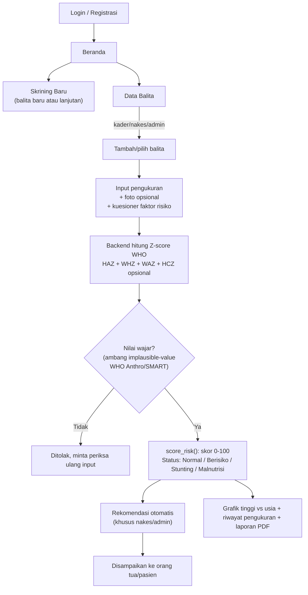

# SmartGrowth

Sistem telescreening berbasis AI untuk deteksi dini risiko **stunting** dan
**wasting** pada balita, sekaligus monitoring pertumbuhan rutin. Kolaborasi
Fakultas Ilmu Komputer × Fakultas Kedokteran, President University.

## Fitur utama

- **Klasifikasi risiko berbasis Z-score WHO** — Height-for-Age (stunting),
  Weight-for-Length/Height (wasting), Weight-for-Age (berat badan kurang),
  dan Head-Circumference-for-Age (opsional, mikrosefali), semua dihitung
  dari tabel referensi resmi WHO Child Growth Standards (bukan rumus
  perkiraan). Digabung lewat skor tertimbang 0-100 (`score_risk()`) jadi
  status 4-tier: **Normal / Berisiko / Stunting / Malnutrisi**.
- **Tren pertumbuhan (2T)** — deteksi berat badan tidak naik 2x pengukuran
  berturut-turut, konvensi Posyandu Indonesia (Buku KIA/KMS).
- **Rentang normal sebagai panduan input** — hint "Normal: X–Y cm/kg" di
  form pengukuran sebelum data disubmit.
- **CRUD lengkap** untuk data balita dan riwayat pengukuran pertumbuhan,
  lengkap dengan grafik tinggi terhadap usia, foto dokumentasi opsional, dan
  laporan PDF per anak.
- **Jadwal Posyandu** — kader/nakes bisa mencatat jadwal kunjungan
  berikutnya, dengan pengingat notifikasi browser lokal.
- **Edukasi gizi & tumbuh kembang** — materi ASI/MPASI, Isi Piringku, tanda
  bahaya, mitos vs fakta, dan FAQ.
- **Permission berbasis role** — kader (input data), nakes (validasi & CRUD
  penuh), viewer (read-only), admin (full access).
- **Autentikasi JWT** dengan login & registrasi publik (role kader/nakes/viewer).
- **PWA offline-first** — tetap bisa dibuka dan menampilkan data yang sudah
  di-cache tanpa koneksi internet, ditujukan untuk kader posyandu di area
  dengan konektivitas terbatas.

## Alur sistem



1. **Login/Registrasi** — kader/nakes/viewer bisa daftar sendiri; admin dibuat lewat `createsuperuser`.
2. **Beranda** — ringkasan statistik (balita terdaftar, total skrining, berisiko, stunting/malnutrisi) dan skrining terbaru.
3. **Skrining Baru** — satu form untuk balita baru (data anak + pengukuran pertama sekaligus) atau balita yang sudah terdaftar (pengukuran lanjutan), termasuk foto dokumentasi opsional.
4. **Perhitungan otomatis** — backend menghitung HAZ, WHZ, WAZ, dan HCZ (kalau lingkar kepala diisi) dari tabel resmi WHO Child Growth Standards. Nilai yang tidak masuk akal (indikasi salah input) ditolak sebelum sempat tersimpan.
5. **Status risiko 4-tier** — Normal / Berisiko / Stunting / Malnutrisi, dari skor tertimbang `score_risk()` yang menjumlahkan kontribusi tiap indikator, bukan cuma ambil yang paling parah.
6. **Rekomendasi** — khusus tampil untuk nakes/admin di popup hasil pengukuran, untuk disampaikan langsung ke orang tua/pasien saat konsultasi.
7. **Riwayat & Jadwal** — riwayat pengukuran lintas semua balita, dan jadwal kunjungan Posyandu berikutnya.

## Struktur repo

```
smartgrowth/
├── smartgrowth-backend/   # Django REST Framework — API, model, logika Z-score WHO
└── smartgrowth-pwa/       # React + TypeScript + Vite — PWA frontend
```

Dokumentasi setup, arsitektur, dan detail teknis masing-masing ada di README
tiap folder:

- [`smartgrowth-backend/smartgrowth-backend/README.md`](smartgrowth-backend/smartgrowth-backend/README.md) —
  setup Django, cakupan API, alur perhitungan risiko, permission per role.
- [`smartgrowth-pwa/smartgrowth-pwa/README.md`](smartgrowth-pwa/smartgrowth-pwa/README.md) —
  setup Vite/PWA, alasan desain (Capacitor-ready, offline-first), alur auth.

## Menjalankan secara lokal (ringkas)

1. **Backend**: ikuti bagian "Setup" di README backend, jalankan
   `python manage.py runserver` (port 8000).
2. **Frontend**: butuh Node.js 18+, ikuti bagian "Local development" di
   README frontend, jalankan `npm run dev` (port 5173) — proxy `/api/*` ke
   backend sudah dikonfigurasi.
3. Buka `http://localhost:5173`, daftar/masuk, lalu mulai input data balita.

## Deploy ke production

Live di **https://smartgrowth.f-mc.my.id**. Detail infrastruktur deployment
sengaja tidak didokumentasikan di repo publik ini.

## Status

Klasifikasi risiko Tahap 1 (rule-based, WHO Z-score HAZ+WHZ+WAZ+HCZ, status
4-tier) sudah selesai dan tervalidasi terhadap data resmi WHO (lihat unit
test di `smartgrowth-backend/smartgrowth-backend/apps/growth/tests.py`).
Halaman aplikasi (Beranda, Skrining, Data Balita, Riwayat, Edukasi, Jadwal
Posyandu) lengkap dan tampilannya diselaraskan dengan desain prototype
awal proyek ini. Model prediktif Tahap 2 (ML) sengaja belum dikerjakan —
menunggu Tahap 1 stabil di penggunaan nyata terlebih dahulu.
